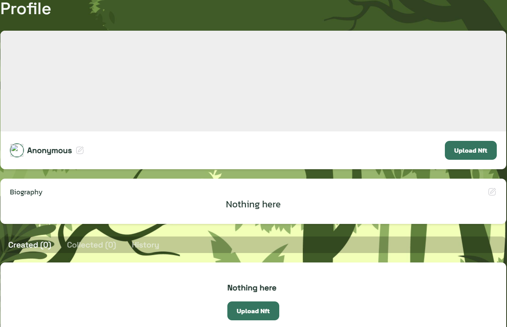

# NFT Marketplace

**BecoSwap NFT marketplace** is a curated NFT platform that spotlights top emerging artists with the purpose of helping, empowering and adding value to those creative minds that are constantly challenging themselves in the creative field. New global marketplace will become the premier destination for NFTs and digital collectibles across mediums, from visual arts and gaming to music and sports. Aim is to provide the NFT trading platform in the world with the best minting, buying and exchanging experience, by leveraging the fastest and cheapest solutions powered by blockchain infrastructure and community.

**Inside our NFT Marketplace**, regarding to art, you could find almost everything:

* **Artists** for new promising Artists.
* **Meme Contests** for cobranded activities with partners, or directly NFT issued by them.

**And beyond Art**, you could also find lots of gamification and NFT + DeFi solutions such as **In-game Pets** like $DPET.

After few focus groups with both investors and artists, we decided that to attract the talent, we needed a platform with a quality look and feel of this brand new, multi-purpose and fully functional marketplace, and also a curated one, to raise the collectible value, and attract investors to KardiaChain. We can also complement our KardiaChain Artists, that can keep working hard to be promoted to Featured, and have the rights to expose at BecoSwap NFT marketplace.

## **Personal NFT profile**

BecoSwap supports personalized profiles for users. These profiles allow you to choose your own name, profile picture, banner and additional personal information.

After filling account information, you need to sign that data using your own private key in KardiaChain wallet extension to avoid forgery.

## **Creating NFTs on Beco marketplace**

After creating a profile, users can upload NFT for bidding and selling. They can manage their created and collected NFTs as well as their transaction history.

The original authors will deserve their life-time copyright fee \(maximum 50% of the sale price\) every time their NFTs are transferred on BecoSwap marketplace. Users can create NFTs from their images, GIFs, music and video files with **50 KAI** **creation fee** for each. This creation fee can be adjusted, depends on the KAI price on market.

## **Voting**

You will be able to vote for your favorite artworks and push them on top of the homepage. The more votes an artwork has, the higher it ranks. We can see that there is a "Like" button in the bottom right corner of each NFT. When you click the "Like" button, a popup for voting will appear for you to approve and vote. Then input the amount of BECO you want to vote in. 1 vote needs 1 BECO. You can put in more BECO if you’d like to give more votes! Then click the “Vote Now” button in the pop-up to complete the vote.

Owners of an NFT artwork will get half of the BECO voted, and BecoSwap will get the remaining part for operational use. The more votes an artwork has, the higher it ranks on the homepage. And we have also added ranking by votes in the NFT marketplace. The BECO voting amount is separated and transferred to original authors right after the vote is sent.

## Buying and Bidding

After a NFT is listed on BecoSwap NFT marketplace, it can be available for other users to buy or bid. There are 2 status of a NFT: On Sale and On Auction. The "On Auction" NFT can only be bid the price, while the "On Sale" NFT is available for everyone to bid and buy.

You can also see the bidding list and transaction history in this details page. Please note that part of the paid BECO tokens may be return to the original authors as their copyright fee, and 5% of the paid BECO tokens will be used for operational purposes of Beco ecosystem too.

We will do more improvements to the NFT supermarket and bring more fun things in the near future. Stay tuned!

