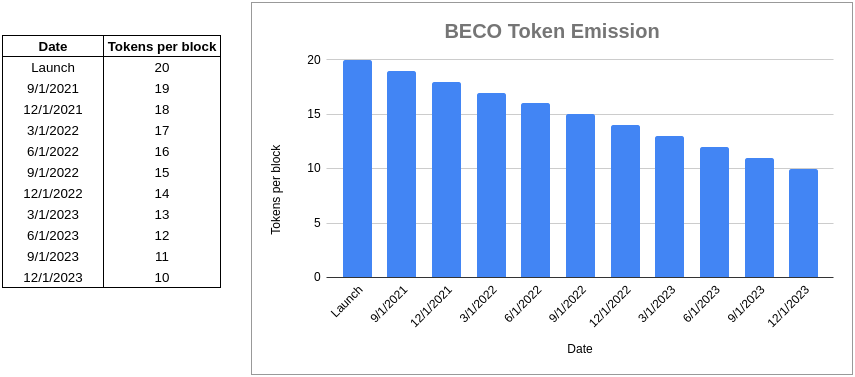

# Beco Token

## Basic Information

#### Kardiachain \(KRC20\)

* Token Name: BecoToken
* Token Symbol: BECO
* Decimal: 18 
* Contract Address: [0x2Eddba8b949048861d2272068A94792275A51658](https://explorer.kardiachain.io/token/0x2Eddba8b949048861d2272068A94792275A51658)
* Chain: Kardiachain \(KRC20\)
* Max Supply: Unlimited
* Zero Initial Mining

### Transfer Tax

* ~~Burn Rate: 2% of transfer tax will be burned immediately~~
* ~~Automatic Liquidity Rate: 8% of transfer tax will be added to the LP pool and locked.~~
* Total Transfer Tax Rate: ~~**10%**~~ **0% of every transfer**

### Emission Rate

* ~~100~~ 20 BECO / block
* ~~2,880,000~~  345.600 BECO / day
* 2% for the development process
* 1% for marketing to ensure essential growth of the project
* 2% for buying potential projects' token to create more farming pools
* 5% for buying back BECO for burning

## BECO Token Emission

